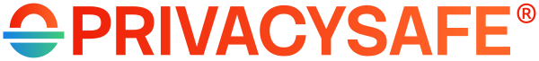

  

<h1 align="center">Your Private Life, Locked In</h1>

<h2 align="center">
Sign up free, no phone number required 👉 <a href="https://privacysafe.app">PrivacySafe.app</a>
</h2>

  
  
  
  

PrivacySafe is privacy-by-design software for home, teams, and organizations. Our source code is also published at [codeberg.org/PrivacySafe](https://codeberg.org/PrivacySafe)

Install PrivacySafe on:

* 💻 [Windows](https://download.privacysafe.app/nightly/windows/) ([checksum](https://download.privacysafe.app/nightly/windows/checksums.json))
* 🍏 [macOS](https://download.privacysafe.app/nightly/mac/) ([checksum](https://download.privacysafe.app/nightly/mac/checksums.json))
* 🐧 [GNU/Linux](https://download.privacysafe.app/nightly/linux/) ([checksum](https://download.privacysafe.app/nightly/linux/checksums.json))
* 🤖 [Android testing](https://download.privacysafe.app/nightly-android/) ([checksum](https://download.privacysafe.app/nightly-android/checksums.json))

[Sign up free](https://privacysafe.app) at `@privacysafe.xyz`, choose Gold at `@privacysafe.me`, or Platinum at `@privacysafe.gg`. Organizations can use their own domain and deploy the [server code](https://github.com/PrivacySafe/spec-server).

## 🔐 PrivacySafe: Your Secure Zone

A secure zone that you control. PrivacySafe is built from Free/Libre and Open Source Software (FLOSS) and uses a modular architecture designed around user-held keys and verifiable software:

* **PrivacySafe Contacts:** Private address book. [Source](https://github.com/PrivacySafe/contacts.app.privacysafe.io)
* **PrivacySafe Chat:** E2EE text, voice, and video. [Source](https://github.com/PrivacySafe/chat.app.privacysafe.io)
* **PrivacySafe Treasure:** A vault for passwords, recovery phrases, payment cards, and sensitive records. [Source](https://github.com/PrivacySafe/treasure.app.privacysafe.io)
* **PrivacySafe Storage:** Encrypted files and shared folders. [Source](https://github.com/PrivacySafe/files.app.privacysafe.io)
* **PrivacySafe Inbox:** Replacement for email designed to reduce phishing and ransomware. [Source](https://github.com/PrivacySafe/inbox.app.privacysafe.io)
* **PrivacySafe App Store:** Secure software supply chain for the PrivacySafe environment. [Source](https://github.com/PrivacySafe/launcher.app.privacysafe.io)

PrivacySafe is modular and portable. Portable builds can run from removable media, and we publish 100% of our client and server source code.

Other client-side pieces:

* **PrivacySafe Startup:** Startup and account creation. [Source](https://github.com/PrivacySafe/startup.app.privacysafe.io)
* **3NWeb Client Library:** Libraries for building compatible applications. [Source](https://github.com/PrivacySafe/3n-client-lib)

Server-side:

* **[Protocols at IEEE](https://opensource.ieee.org/3nweb):** 3NWeb protocol documentation is hosted at IEEE SA Open.
* **3NWeb Spec Server:** Reference server implementation. [Source](https://github.com/PrivacySafe/spec-server)

## 🌐 Free Public Services

* [PrivacySafe Social](https://privacysafe.social): Social community without advertising or algorithmic timeline manipulation. [Source](https://github.com/PrivacySafe/privacysafe-social-ui)
* [PrivacySafe Search](https://privacysafe.is): Privacy-respecting web search.
* [PrivacySafe Bot](https://privacysafe.bot): Password and passphrase generator. [Source](https://github.com/PrivacySafe/privacysafe-bot)
* [PrivacySafe Locker](https://privacysafe.locker): Share private files and memos. [Source](https://github.com/PrivacySafe/privacysafe-locker)

## 🏛️ PrivacySafe Foundation

[PrivacySafe Foundation](https://privacysafe.foundation) is a 501(c)(3) nonprofit public charity supporting free software, cybersecurity education, decentralized technology, documentation, and public-interest research.

### Support the Foundation

* [Donate directly to the Foundation](https://privacysafe.foundation)
* [Open Collective](https://opencollective.com/privacysafe)
* [Ko-fi](https://ko-fi.com/R6R1194HN7)
* [Liberapay](https://liberapay.com/PrivacySafe/donate)

The Foundation website also provides options for card donations, PayPal/Venmo, cryptocurrency, checks, and other forms of support.

## 🛒 Ivy Cyber

[Ivy Cyber](https://ivycyber.com) publishes and supports commercial PrivacySafe offerings, including paid identities, hosting, infrastructure, enterprise deployment, hardware, training, and technical support.

* [PrivacySafe products and services](https://ivycyber.com)
* [Shop](https://ivycyber.com/shop/)
* [Private cryptocurrency checkout](https://cryptopay.ivycyber.com/)

## 📚 Documentation

* [Architecture Overview](https://github.com/PrivacySafe/3NWeb-architecture): PrivacySafe is built on 3NWeb architecture, protocols, and formats. Also mirrored at [IEEE SA Open](https://opensource.ieee.org/3nweb/architecture).
* [User Guides](https://github.com/PrivacySafe/privacysafe-userguides): Guides for PrivacySafe applications.
* [PrivacySafe VPN User Guide](https://github.com/PrivacySafe/privacysafe-userguides/blob/main/privacysafe-vpn-setup.md): For organizations where Ivy Cyber deploys VPN services.
* [PrivacySafe Social Features](https://github.com/PrivacySafe/privacysafe-social-ui): Features of the PrivacySafe Social Mastodon service.
* [PrivacySafe Identity](https://github.com/PrivacySafe/privacysafe-identity): Graphics, logos, fonts, and branding.

## 🗄️ Past Projects

We keep our history public. These projects and their source remain available, but they are not part of the current PrivacySafe software or public services:

* **PrivacySafe Link:** Secret notes that self-destruct after reading. [Archives](https://github.com/PrivacySafe/privacysafe-link)
* **StickTock:** Watch, download, and share TikTok videos through a privacy-oriented interface. [Archives](https://github.com/PrivacySafe/sticktock)
* **RefreshView Browser:** A minimal browser project focused on a cleaner web experience. [Archives](https://github.com/PrivacySafe/refreshview-browser)
* **CertMagi.cc:** Experimental verified-document publishing using distributed and censorship-resistant infrastructure. [Archives](https://github.com/PrivacySafe/certmagicc)

## 🤝 Contributing

Contributions are welcome. Please fork, remix, and submit focused pull requests.

⚠️ Never send sensitive information about yourself or other users through ordinary direct messages or unencrypted email.

* **Bugs & Security Issues:** See [`SECURITY.md`](SECURITY.md).
* **AI Contribution Policy:** See [`AI_POLICY.md`](AI_POLICY.md) before submitting a pull request.
* **Report Abuse:** Email [abuse@privacysafe.net](mailto:abuse@privacysafe.net) using the published [GPG key](https://psafe.ly/xSpQhF) when sensitive information is involved.

## 📰 Newsletter

🤖 **[Bits On Tape](https://bitsontape.com)** is our newsletter covering cybersecurity, privacy, FLOSS, AI, and digital culture. [Subscribe Now](https://bitsontape.com)

## ⚖️ License

© 2026 <a href="https://ivycyber.com" rel="nofollow">Ivy Cyber LLC</a>. This project is dedicated to ethical <a href="https://fsf.org/" rel="nofollow">Free/Libre and Open Source Software (FLOSS)</a>. PrivacySafe® and 3NWeb® are registered trademarks. PrivacySafe Foundation™ and Ivy Cyber™ are pending trademarks. Please see individual project repositories for licensing information.
